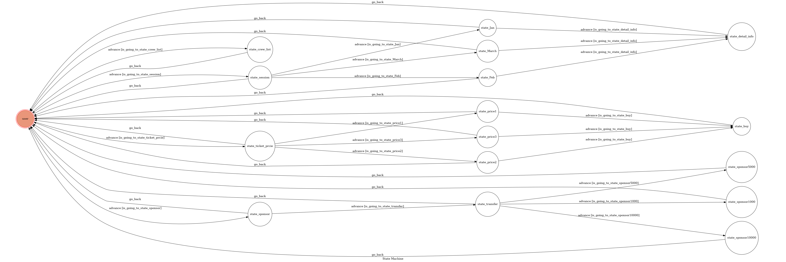

# TOC Project 2019

Template Code for TOC Project 2019

A Facebook messenger bot based on a finite state machine

More details in the [Slides](https://hackmd.io/p/SkpBR-Yam#/) and [FAQ](https://hackmd.io/s/B1Xw7E8kN)

## Setup

### Prerequisite
* Python 3
* Facebook Page and App
* HTTPS Server

#### Install Dependency
```sh
pip3 install -r requirements.txt
```

* pygraphviz (For visualizing Finite State Machine)
    * [Setup pygraphviz on Ubuntu](http://www.jianshu.com/p/a3da7ecc5303)

#### Secret Data

`VERIFY_TOKEN` and `ACCESS_TOKEN` **MUST** be set to proper values.
Otherwise, you might not be able to run your code.

#### Run Locally
You can either setup https server or using `ngrok` as a proxy.

**`ngrok` would be used in the following instruction**

```sh
./ngrok http 5000
```

After that, `ngrok` would generate a https URL.

#### Run the sever

```sh
python3 app.py
```

## Finite State Machine


## Usage
The initial state is set to `user`.

* user
	* Input: "查詢演出場次"
		* Reply: "您想要查詢哪一個月份的場次?(一月/二月/三月)"

	* Input: "查詢票價"
		* Reply: "您想查詢什麼位置的票價?(貴賓席/搖滾區/一般區)"

	* Input: "我想贊助你們"
		* Reply: "使用轉帳(是)"

	* Input: "查詢工作人員名單"
		* Reply: "工作人員名單如下\n------藝術組------\n導演：湯雅瑭\n編劇：吳念真\n演員：陳怡亘 吳念真 郭予凡\n陳宜青 張瑋庭 徐子歡\n\n------技術組------\n舞台監督：黃臆璇\n舞台設計：馬佳琳\n舞台組員：蔡欣芸 張碩真 藍詩雅 林欣融\n燈光設計：李沛思\n音效設計：王凱莉\n服化妝設計：黃子菁\n服化妝組員：吳念真 吳沛潔\n\n------行政組------\n行政組長：曾恩瑜\n宣傳：馬佳琳 何竹昀 張碩真\n公關：黃沛瑀 藍詩雅\n前台：秦仕真 吳欣凌 蔡欣芸 林欣融 黃珮慈"
* state_session
	* Input: "一月"
		* Reply: "一月演出場次為1/11(五) 1/18(五) 1/25(五)\n輸入'場次詳細資訊'以獲得更多資訊"

	* Input: "二月"
		* Reply: "二月演出場次為2/15(五) 2/22(五)\n輸入'場次詳細資訊'以獲得更多資訊"

	* Input: "三月"
		* Reply: "三月演出場次為3/04(五) 3/11(五)\n輸入'場次詳細資訊'以獲得更多資訊"
* state_ticket_prcie
	* Input: "貴賓席"
		* Reply: "貴賓席的票價為$800\n是否確認購買(確認購買)"

	* Input: "搖滾區"
		* Reply: "搖滾區的票價為$500\n是否確認購買(確認購買)"

	* Input: "一般區"
		* Reply: "一般區的票價為$300\n是否確認購買(確認購買)"
* state_sponsor
	* Input: "是"
		* Reply: "請輸入贊助金額($1000/$5000/$10000)"
* state_Jan, state_Feb, state_March
	* Input: "場次詳細資訊"
		* Reply: "該月場次資訊:\n\n地點\n屏東藝術館(中正藝術館)\n900屏東縣屏東市和平路427號\n\n時間:\n18:00入場\n18:30開演"
* state_price1, state_price2, state_price3
	* Input: "確認購買"
		* Reply: "購買成功!!!感謝您的支持~"
* state_transfer
	* Input: "$1000"
		* Reply: "謝謝您贊助我們1000^^"

	* Input: "$5000"
		* Reply: "謝謝您贊助我們5000^^"

	* Input: "$10000"
		* Reply: "非常感謝您贊助我們10000^^"


## Reference
[TOC-Project-2017](https://github.com/Lee-W/TOC-Project-2017) ❤️ [@Lee-W](https://github.com/Lee-W)
